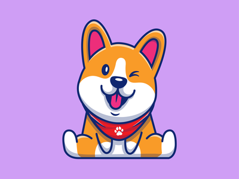

# Doggy-s-R-Us

# AC
As a user I want to make an account to make an appointment for my dog.

Given I need my god groomed,
then I can choose what package will fit the needs of my dog.
Given I've chosen the package that fits my dog's needs,
Then I will create an appointment for my dog to be pampered and groomed

# Project Requirements

You and your group will use everything you’ve learned over the past six units to create a real-world full-stack application that you’ll be able to showcase to potential employers. The user story and acceptance criteria will depend on the project that you create, but your project must fulfil the following requirements:

* Use Node.js and Express.js to create a RESTful API.

* Use Handlebars.js as the template engine.

* Use MySQL and the Sequelize ORM for the database.

* Have both GET and POST routes for retrieving and adding new data.

* Use at least one new library, package, or technology that we haven’t discussed.

* Have a folder structure that meets the MVC paradigm.

* Include authentication (express-session and cookies).

* Protect API keys and sensitive information with environment variables.

* Be deployed using Heroku (with data).

* Have a polished UI.

* Be responsive.

* Be interactive (i.e., accept and respond to user input).

* Meet good-quality coding standards (file structure, naming conventions, follows best practices for class/id naming conventions, indentation, quality comments, etc.).

* Have a professional README (with unique name, description, technologies used, screenshot, and link to deployed application).

## Presentation Requirements

Use this [project presentation template](https://docs.google.com/presentation/d/10QaO9KH8HtUXj__81ve0SZcpO5DbMbqqQr4iPpbwKks/edit?usp=sharing) to address the following: 

* Elevator pitch: a one minute description of your application

* Concept: What is your user story? What was your motivation for development?

* Process: What were the technologies used? How were tasks and roles broken down and assigned? What challenges did you encounter? What were your successes?

* Demo: Show your stuff!

* Directions for Future Development

* Links to the deployed application and the GitHub repository. Use the [Guide to Deploy with Heroku and MySQL](https://coding-boot-camp.github.io/full-stack/heroku/deploy-with-heroku-and-mysql) on The Full-Stack Blog if you need a reminder on how to deploy to Heroku.

## About Us
**We made Doggy’RUS for dog lovers. Doggy’R US is a sleek way to schedule your dog for grooming and pampering.**

## D-Bone
we worked togther as a team to be able to present a well functional page. With the help of Sid and Jesse, thinking 
about an idea, was fairly easy. With Sid as the project manager, we were able to over come some of our obsatacles.
The first of which was the fact that we had too many things that were not needed such as tables and models. Another 
roadblock we ran into was how our naming was for our files. After alot of hard work, trial and error, our team pulled
through. Sid and Jesse were mainly involved in the backend of things. While Zaymon tried to provide a good front end
and helped with debugging. Overall, everyone helped eachother in order to achieve the desired outcome. A few things we 
would like to add in the future is a  better user interface for them to adda picture of their dog so it can be rendered 
into the customer page just to make it a bit more user friendly.
